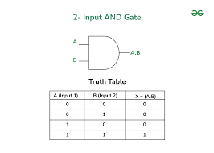
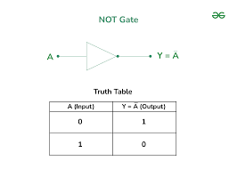
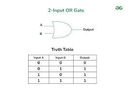

# circom-Verifying
We Are Going To Code An Basic Circuit With Signal Gates Like AND,NOT and OR Gates And Going To Verify THe cicuit Coded Using Circom Language With An Verifier Contract THat Deployed Into [Amoy](https://amoy.polygonscan.com/) And Generate Any Proof Of Specefic Inputs And Verify Using Verfier For Input a=0,b=1 For  Circuit And Getting Result As TRUE                                                                     

## Description
For You Need To Code in circom zsnark You Need To Have Basic Knowledge About All The circuit Gates ,A Simple Idea Is Provided Below So THat You Can GEt What Are The Different Gates And How They Work
## AND GATE

## NOT GATE

## OR GATE

* These Are The Gates Use In THe Circuit DEmonstrated In This Project
* We Connect These Gates With Input Of One Gate To Output Of Another Gate To Make The Gate Circuit
* THe Circuit That We Gonna Code Is tHe On Given Below:                                                                                                                                                               

**CircuitTemplates**
For Coding The Functionalities Of Each Gate We Are Using Templates Provided By [circomlib](https://github.com/iden3/circomlib) For Making Our Life Little Bot Easier!!!


## Getting Started
For Getting Started You Need An IDE Online OR Offline And Some Library Dependencies Of circom Which Is Provided  In The Package.json File Which You Can install By Simply Running The Code:
```
npm i
```

* As For IDE You Can Use Offline IDE Like[Vscode](https://code.visualstudio.com/download) Or You Can Use Online IDE Like [REmix](https://remix.ethereum.org/)Or[Gitpod](https://gitpod.io/)            
* Next You Need To Install Necessary Dependencies:

        
   Hardhat:[install](https://hardhat.org/)
 
   nodeJs:[install](https://nodejs.org/en/download/current)                                                                                                                 

 
* Now You Can Design Your On circuit Using Different Types OF Gates Template Provided [HERE!](https://github.com/iden3/circomlib)
                                                                                                                                              
### Installing

* Now You Need To Install The Project Template Circuit Files By Cloning This Reprository

* Now You Need Some Test MATIC On Your Wallet If You Dont You Can It For Free From [Amoy Faucet](https://faucet.polygon.technology/) here

* Dont Forget To Paste Your Wallet Private Key On env.example File And Change The Name Of Tile Into ".env"

* Now You Are ALl Set Lets Run The Program 
### Executing program

* First install All npm Dependencies By Running:
  
```
npm i
```
* Next Lets Compile Our Cicuit By Typing:
  
```
npx hardhat circom
```
This will generate the **out** file with circuit intermediaries and geneate the **MultiplierVerifier.sol** contract

* Next We Need To Give The Input For (a,b) For the And Gate For That Just Go To input.json :

```
{
  "a": "0",
  "b": "1"
}
```
This will Be The Input Data While We Generate Our Proof

* Finally We Will Deploy Our Verifier To Amoy Testnet Polyscan And Verify Our Proof By:

```
npx hardhat run scripts/deploy.ts --network amoy
```
This script does 4 things  
1. Deploys the MultiplierVerifier.sol contract Into Amoy Testnet
2. Generates a proof from circuit intermediaries with `generateProof()` With Input(0,1)
3. Generates calldata with `generateCallData()`
4. Calls `verifyProof()` on the verifier contract with calldata

With two commands you can compile a ZKP, generate a proof, deploy a verifier, and verify the proof 🎉

You Can Check Your Verifier Contract Creation In [Amoy Testnet polyscan](https://amoy.polygonscan.com/) By Pasting Your Contract ID

### Directory Structure
**circuits**
```
├── multiplier
│   ├── circuit.circom
│   ├── input.json
│   └── out
│       ├── circuit.wasm
│       ├── multiplier.r1cs
│       ├── multiplier.vkey
│       └── multiplier.zkey
├── new-circuit
└── powersOfTau28_hez_final_12.ptau
```
Each new circuit lives in it's own directory. At the top level of each circuit directory lives the circom circuit and input to the circuit.
The **out** directory will be autogenerated and store the compiled outputs, keys, and proofs. The Powers of Tau file comes from the Polygon Hermez ceremony, which saves time by not needing a new ceremony. 


**contracts**
```
contracts
└── MultiplierVerifier.sol
```
Verifier contracts are autogenerated and prefixed by the circuit name, in this example **Multiplier**
## Help
* This Is A Simple Coding An deploying Process .The Chance of Getting Error Is Very Minimum  Because With Just One Command You Can DEploy Your Verifier To Amoy Net Work And Verify Your Circuit
* But Even By Chance If You Encounter Any Error Feel Free To Email For Clearing Any Doubts That In Your Mind
* "THANK YOU!!!"
```
akshaypsandhya@gmail.com
```

## Authors

Contributors names and contact info:

Amar
[@Akshay](akshaypsandhya@gmail.com)


## License

This project is licensed under the [akshy] License - see the LICENSE.md file for details
